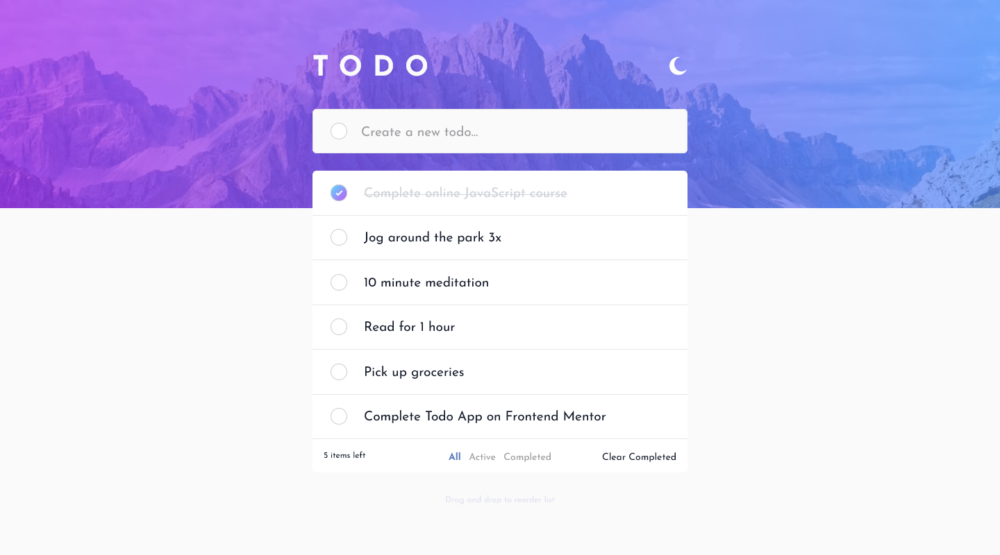

# Frontend Mentor - Todo app solution

This is a solution to the [Todo app challenge on Frontend Mentor](https://www.frontendmentor.io/challenges/todo-app-Su1_KokOW). Frontend Mentor challenges help you improve your coding skills by building realistic projects.

## Table of contents

1. [Frontend Mentor - Todo app solution](#frontend-mentor---todo-app-solution)
   1. [Table of contents](#table-of-contents)
   1. [Overview](#overview)
      1. [The challenge](#the-challenge)
      1. [Screenshots](#screenshots)
         1. [Desktop](#desktop)
         1. [Mobile](#mobile)
      1. [Links](#links)
   1. [My process](#my-process)
      1. [Built with](#built-with)
      1. [Interesting parts](#interesting-parts)
         1. [Disable :hover pseudo-class on mobile](#disable-hover-pseudo-class-on-mobile)
         1. [Better control over todo item styling and function on mobile](#better-control-over-todo-item-styling-and-function-on-mobile)
         1. [Drag-and-Drop](#drag-and-drop)
         1. [Theming](#theming)
         1. [Javascript: move array element from index to another](#javascript-move-array-element-from-index-to-another)
         1. [Tailwind](#tailwind)
         1. [NPM packages](#npm-packages)
         1. [React](#react)
         1. [`font-size` minimums on mobile devices](#font-size-minimums-on-mobile-devices)
         1. [`<meta name="theme-color:">` for both light and dark themes](#meta-nametheme-color-for-both-light-and-dark-themes)
      1. [Useful resources](#useful-resources)
   1. [Author](#author)

## Overview

### The challenge

Users should be able to:

- View the optimal layout for the app depending on their device's screen size
- See hover states for all interactive elements on the page
- Add new todos to the list
- Mark todos as complete
- Delete todos from the list
- Filter by all/active/complete todos
- Clear all completed todos
- Toggle light and dark mode
- **Bonus**: Drag and drop to reorder items on the list
- **Bonus**: Store todos in localStorage

### Screenshots

#### Desktop



#### Mobile


### Links

- Solution URL: [GitHub](https://github.com/theperiscope/react-todo-app)
- Live Site URL: [Netlify](https://unique-croissant-035b0b.netlify.app/)

## My process

### Built with

- Semantic HTML5 markup
- CSS custom properties
- Flexbox
- CSS Grid
- Mobile-first workflow
- [React](https://reactjs.org/) - JS library
- [Tailwind CSS 3](https://tailwindcss.com/) - For styles

### Interesting parts

#### Disable :hover pseudo-class on mobile

The `:hover` pseudo-class interferes with user input on touch devices. We fix it by grouping all :hover rules into @media(hover: hover)

```css
@media (hover: hover) {
  input[type="checkbox"]:hover {
    /*...*/
  }
  input[type="checkbox"]:hover::after {
    /*...*/
  }
  .checkbox-wrapper:hover button {
    /*...*/
  }
}
```

#### Better control over todo item styling and function on mobile

```css
.checkbox-wrapper input[type="checkbox"] {
  outline: none;
  appearance: none;
  user-select: none;
  pointer-events: none;
  /*...*/
}
```

#### Drag-and-Drop

[Draggable attribute](https://developer.mozilla.org/en-US/docs/Web/API/HTML_Drag_and_Drop_API/Drag_operations)

```html
<div draggable></div>
```
By default, data/elements cannot be dropped in other elements. To allow a drop, we must prevent the default handling of the element

```js
  const onDragOver = (e, id) => {
    e.preventDefault()
  }
```

#### Theming

Detect preferred theme on first access and store in local storage

```js
const getInitialTheme = () => {
  if (typeof window !== "undefined" && window.localStorage) {
    const storedPrefs = window.localStorage.getItem("theme")
    if (typeof storedPrefs === "string" && storedPrefs !== null) {
      return storedPrefs === "dark" ? themes.dark : themes.light
    }

    const userMedia = window.matchMedia("(prefers-color-scheme: dark)")

    if (userMedia.matches) {
      return themes.dark
    }
  }

  return themes.light
}
```

#### Javascript: move array element from index to another

```js
  const arrayMove = (arr, fromIndex, toIndex) => {
    // shouldn't happen but this is to add elements if toIndex is past number of elements in the array
    if (toIndex >= arr.length) {
      var toAdd = toIndex - arr.length + 1
      while (toAdd--) {
        arr.push(undefined)
      }
    }
    arr.splice(toIndex, 0, arr.splice(fromIndex, 1)[0])
    return arr // for testing
  }
```

#### Tailwind

- Manual dark mode by adding class to `<html>` body

  ```js
  useEffect(() => {
    // https://tailwindcss.com/docs/dark-mode
    if (localStorage.theme === 'dark' || (!('theme' in localStorage) && window.matchMedia('(prefers-color-scheme: dark)').matches)) {
      document.documentElement.classList.add('dark')
    } else {
      document.documentElement.classList.remove('dark')
    }
  })
  ```

- Task-related configuration for media breakpoints, colors, backgrounds, etc. in `tailwind.config.js`

#### NPM packages

- [React Icons](https://www.npmjs.com/package/react-icons)
- [uuidv4](https://www.npmjs.com/package/uuidv4) to generate unique task ids

  ```js
  const newTask = {
    id: uuid(),
    label: taskName,
    checked: false
  }
  ```

#### React

- Light/Dark theming using the React Context API

  ```jsx
  import { themes, ThemeContext } from './ThemeContext'

  const root = ReactDOM.createRoot(document.getElementById('root'))
  root.render(
    <React.StrictMode>
      <ThemeContext.Provider value={themes.light} >
        <App />
      </ThemeContext.Provider>
    </React.StrictMode>
  )
  ```

- Dynamic class names

  ```html
  <div className={`filter ${currentFilter === 'all' && 'active'}`}>...</div>
  ```

#### `font-size` minimums on mobile devices

By default Safari on iOS will zoom in the screen to focus on an input field (i.e. the Add Todo input) if the font size is less than 16 pixels. We are using 12 pixels and setting `maximum-scale=1` for the viewport prevents the _16 pixels_ rule from being applied.

```html
<meta name="viewport" content="width=device-width, initial-scale=1, maximum-scale=1" />
```

#### `<meta name="theme-color:">` for both light and dark themes

The `manifest.json` file also has settings for theme and background color but the presence of the HTML `meta` tags overrides the value.

```html
<meta name="theme-color" media="(prefers-color-scheme: light)" content="#fafafa">
<meta name="theme-color" media="(prefers-color-scheme: dark)" content="#161722">
```

### Useful resources

- [CSS at-rule: @media: hover media feature](https://caniuse.com/mdn-css_at-rules_media_hover)
- [Discussion around @media hover and touch devices](https://stackoverflow.com/questions/23885255/how-to-remove-ignore-hover-css-style-on-touch-devices)
- [16px or Larger Text Prevents iOS Form Zoom](https://css-tricks.com/16px-or-larger-text-prevents-ios-form-zoom/)

## Author

- GitHub - [@theperiscope](https://github.com/theperiscope)
